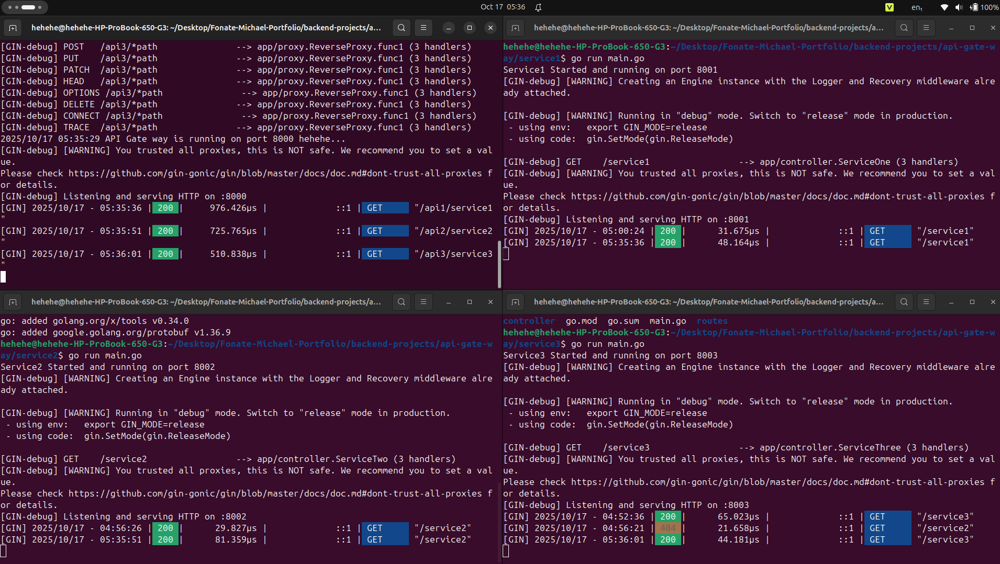
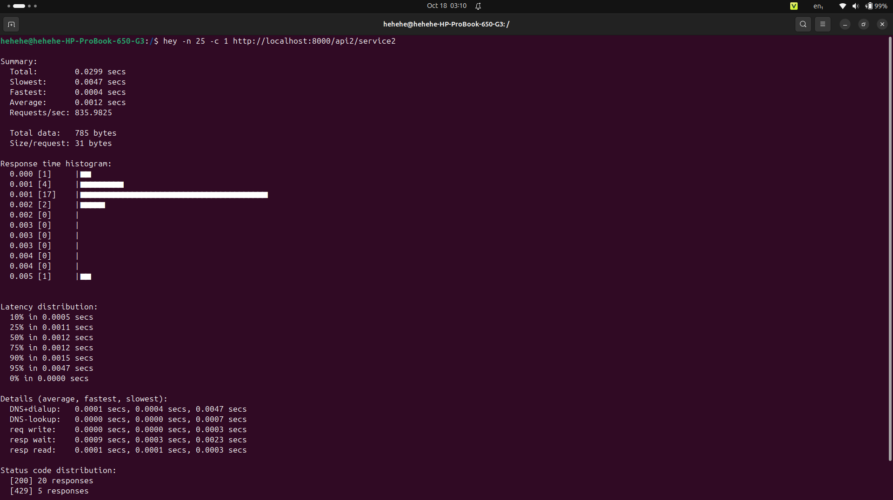

# Simple API Gateway

A lightweight API Gateway built with Go and Gin framework that demonstrates a microservices architecture with reverse proxy functionality. This project serves as a learning example for implementing API gateways and microservices communication patterns.

## 🚀 Features

- **Reverse Proxy**: Routes requests to multiple backend services
- **Rate Limiting**: Built-in rate limiter to prevent abuse (10 req/sec with 20 burst)
- **Environment-based Configuration**: Easy service URL management via `.env` file
- **Microservices Architecture**: Demonstrates service separation and communication
- **Lightweight**: Built with minimal dependencies using Go and Gin
- **Scalable**: Easy to add new services and routes

## 🏗️ Architecture

```
┌─────────────────┐    ┌──────────────────┐
│   API Gateway   │───▶│   Service One    │
│   (Port 8000)   │    │   (Port 8001)    │
└─────────────────┘    └──────────────────┘
         │
         │
         ▼
┌─────────────────┐    ┌──────────────────┐
│   Service Two   │    │   Service Three  │
│   (Port 8002)   │    │   (Port 8003)    │
└─────────────────┘    └──────────────────┘
```

## 📸 Screenshots



*Screenshot showing all services running with the API Gateway successfully routing requests*

### Components

1. **API Gateway** (`/api/`): Main entry point that routes requests to appropriate services
2. **Service One** (`/service1/`): Sample microservice returning "Service One"
3. **Service Two** (`/service2/`): Sample microservice returning "Service Two"
4. **Service Three** (`/service3/`): Sample microservice returning "Service Three"

## 🛠️ Technology Stack

- **Language**: Go 1.25.3
- **Framework**: Gin Web Framework
- **Environment Management**: godotenv
- **Rate Limiting**: golang.org/x/time/rate
- **Reverse Proxy**: Go's built-in `httputil.NewSingleHostReverseProxy`

## 📋 Prerequisites

- Go 1.25.3 or later
- Git

## 🚀 Quick Start

### 1. Clone the Repository

```bash
git clone https://github.com/Fonate-Michael/Simple-API-Gateway.git
cd Simple-API-Gateway
```

### 2. Install Dependencies

Navigate to each service directory and install dependencies:

```bash
# API Gateway
cd api
go mod download

# Service One
cd ../service1
go mod download

# Service Two
cd ../service2
go mod download

# Service Three
cd ../service3
go mod download
```

### 3. Configure Environment

Update the `.env` file in the `api/` directory:

```env
SERVICE_ONE=http://localhost:8001
SERVICE_TWO=http://localhost:8002
SERVICE_THREE=http://localhost:8003
```

### 4. Start the Services

Open multiple terminal windows and start each service:

```bash
# Terminal 1: Service One
cd service1
go run main.go

# Terminal 2: Service Two
cd service2
go run main.go

# Terminal 3: Service Three
cd service3
go run main.go

# Terminal 4: API Gateway
cd api
go run main.go
```

All services should start successfully and display startup messages.

## 📖 API Endpoints

### API Gateway (Port 8000)

The API Gateway acts as a reverse proxy and forwards requests to the appropriate services:

- **GET** `/api1/*` → Routes to Service One
- **GET** `/api2/*` → Routes to Service Two
- **GET** `/api3/*` → Routes to Service Three

### Individual Services

#### Service One (Port 8001)
- **GET** `/service1` → `{"message": "Service One"}`

#### Service Two (Port 8002)
- **GET** `/service2` → `{"message": "Service Two"}`

#### Service Three (Port 8003)
- **GET** `/service3` → `{"message": "Service Three"}`

## 🧪 Testing

### Test API Gateway Routing

```bash
# Test Service One routing
curl http://localhost:8000/api1/service1

# Test Service Two routing
curl http://localhost:8000/api2/service2

# Test Service Three routing
curl http://localhost:8000/api3/service3
```

Expected responses:
```json
{"message": "Service One"}
{"message": "Service Two"}
{"message": "Service Three"}
```

### Test Direct Service Access

```bash
# Test Service One directly
curl http://localhost:8001/service1

# Test Service Two directly
curl http://localhost:8002/service2

# Test Service Three directly
curl http://localhost:8003/service3
```

## 🔧 Configuration

### Environment Variables

| Variable | Description | Default |
|----------|-------------|---------|
| `SERVICE_ONE` | URL for Service One | `http://localhost:8001` |
| `SERVICE_TWO` | URL for Service Two | `http://localhost:8002` |
| `SERVICE_THREE` | URL for Service Three | `http://localhost:8003` |

### Port Configuration

Each service runs on a different port:
- API Gateway: `8000`
- Service One: `8001`
- Service Two: `8002`
- Service Three: `8003`

## 📁 Project Structure

```
api-gate-way/
├── api/                          # API Gateway
│   ├── main.go                   # Main application entry point
│   ├── proxy/
│   │   └── proxy.go              # Reverse proxy implementation
│   ├── .env                      # Environment configuration
│   ├── go.mod                    # Go module dependencies
│   └── go.sum                    # Go module checksums
├── service1/                     # Service One
│   ├── main.go                   # Service entry point
│   ├── controller/
│   │   └── controller.go         # Request handlers
│   ├── routes/
│   │   └── route.go              # Route definitions
│   ├── go.mod                    # Go module dependencies
│   └── go.sum                    # Go module checksums
├── service2/                     # Service Two (same structure as service1)
└── service3/                     # Service Three (same structure as service1)
```

## 🔍 How It Works

### Reverse Proxy Implementation

The API Gateway uses Go's `httputil.NewSingleHostReverseProxy` to forward HTTP requests:

1. **Request Routing**: Incoming requests to `/api1/*`, `/api2/*`, or `/api3/*` are routed to respective services
2. **Path Rewriting**: The gateway strips the `/api{X}` prefix before forwarding the request
3. **Response Forwarding**: Responses from services are passed back to the client unchanged

### Example Request Flow

```
Client Request: GET http://localhost:8000/api1/service1

↓ (API Gateway receives request)

API Gateway strips '/api1' prefix:
→ Internal Request: GET http://localhost:8001/service1

↓ (Service One processes request)

Service One Response: {"message": "Service One"}

↓ (API Gateway forwards response)

Client receives: {"message": "Service One"}
```

## ⚡ Rate Limiting

The API Gateway includes a built-in rate limiter to protect against abuse and ensure fair usage. It uses Go's `golang.org/x/time/rate` package with a token bucket algorithm.

- **Configuration**: Allows 10 requests per second with a burst capacity of 20 requests.
- **Behavior**: Excess requests receive a 429 (Too Many Requests) status code.
- **Implementation**: Applied globally via middleware in `main.go` for all routes.
- **Customization**: Adjust the rate and burst in `var limiter = rate.NewLimiter(10, 20)` as needed.

### Testing Rate Limiting

Use `hey` (install via `go install github.com/rakyll/hey@latest`) to load test:

```bash
hey -n 25 -c 1 http://localhost:8000/api1/test
```

- The first 20 requests should succeed (200 status); the rest should return 429.



*Screenshot showing `hey` output with rate limiting in effect (429 responses for excess requests)*

## 🚦 Development

### Adding a New Service

1. Create a new service directory (e.g., `service4/`)
2. Copy the structure from existing services
3. Update the `.env` file with the new service URL
4. Add a new route in the API Gateway
5. Update the proxy configuration

### Code Organization

Each service follows a consistent structure:
- `main.go`: Application entry point
- `controller/`: Request handling logic
- `routes/`: Route definitions

## 🤝 Contributing

1. Fork the repository
2. Create a feature branch (`git checkout -b feature/amazing-feature`)
3. Commit your changes (`git commit -m 'Add some amazing feature'`)
4. Push to the branch (`git push origin feature/amazing-feature`)
5. Open a Pull Request

## 📄 License

This project is open source and available under the [MIT License](LICENSE).

## 👨‍💻 Author

**Michael Fonate**
- GitHub: [Your GitHub Profile]

## 🙏 Acknowledgments

- Built with [Gin Web Framework](https://gin-gonic.com/)
- Inspired by microservices architecture patterns
- Thanks to the Go community for excellent documentation and tools

---

⭐ If you found this project helpful, please give it a star!
